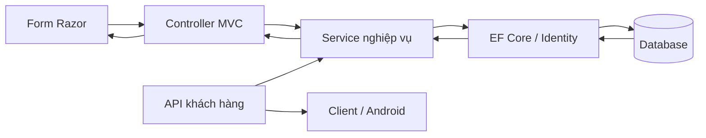

# Trang khách hàng: nghiệp vụ và giải thích mã nguồn

Tài liệu này giải thích toàn bộ luồng khách hàng của **web hiện tại**: đăng ký, đăng nhập, sửa hồ sơ, gửi phản hồi sản phẩm/dịch vụ và nhận/trả lời khảo sát. Các comment tiếng Việt trong source tập trung vào quyết định nghiệp vụ, quyền và xử lý dữ liệu; không lặp lại ý nghĩa của từng dấu ngoặc hoặc câu lệnh hiển nhiên.

## 1. Khách hàng được làm gì?

| Chức năng | Quyền và quy tắc đã triển khai |
|---|---|
| Đăng ký | Người chưa đăng nhập tạo tài khoản Customer. Không tự chọn Staff, Manager hoặc Admin. Email duy nhất, họ tên bắt buộc, xác nhận mật khẩu trên form web. |
| Đăng nhập | Dùng email và mật khẩu. Khóa tạm 10 phút khi sai 5 lần; tài khoản bị quản lý khóa/lưu trữ không được vào. |
| Sửa thông tin | Chỉ sửa họ tên, điện thoại, ngày sinh, địa chỉ, sở thích của mình. Email là định danh đăng nhập và không thay đổi tại form này. |
| Đổi mật khẩu | Cần mật khẩu hiện tại, mật khẩu mới hợp lệ và xác nhận khớp; mật khẩu mới phải khác mật khẩu cũ. |
| Phản hồi | Chọn sản phẩm đang hoạt động hoặc dịch vụ chung, đánh giá 1–5, nội dung 1–2.000 ký tự sau kiểm tra không trắng. Chỉ xem lịch sử và trả lời của chính mình. |
| Nhận khảo sát | Quản lý phát hành tạo lời mời trong tài khoản. Khách không thể tự mở khảo sát không được mời. |
| Thực hiện khảo sát | Một lần cho mỗi lời mời, trước hạn, khi đang phát hành; trả lời đúng kiểu và đủ câu bắt buộc. |
| Xem lại khảo sát | Xem bản trả lời đã lưu cùng thời điểm gửi; không sửa hoặc gửi lần thứ hai. Không xem thống kê toàn quán. |

Nhân viên và quản lý tiếp nhận/trả lời phản hồi. **Quản lý** quyết định nội dung, người nhận, thời hạn khảo sát và xem thống kê. Khách hàng là người cung cấp thông tin và tham gia, không quản trị các dữ liệu này.

## 2. Cách chạy và thử bằng trình duyệt

Từ thư mục `CafeCrm`:

```powershell
dotnet run --project src/CafeCrm.Server
```

Mở `http://localhost:5240/Account/Register`. Tạo tài khoản với email mới và mật khẩu đáp ứng yêu cầu hiển thị. Sau đăng ký, trang đăng nhập báo thành công. Đăng nhập sẽ mở **Góc của tôi** (`/Portal`). Đây là trang tổng quan cá nhân có số phản hồi, khảo sát chờ trả lời, khảo sát đã hoàn thành và lời mời mới.

Thử theo thứ tự:

1. **Hồ sơ của tôi**: sửa họ tên, bổ sung điện thoại/ngày sinh/địa chỉ và chọn sở thích; lưu rồi tải lại để kiểm tra dữ liệu.
2. **Phản hồi của tôi**: chọn một sản phẩm, chấm điểm, nhập góp ý và gửi. Tải lại trang sẽ không gửi lại phản hồi vừa gửi. Bộ lọc giúp tìm phản hồi theo trạng thái.
3. Trong cửa sổ/phiên khác, đăng nhập `staff@cafe.test` với mật khẩu demo `CafeDemo@123`, vào **Phản hồi**, trả lời và cập nhật trạng thái. Quay lại tài khoản khách để xem câu trả lời.
4. Đăng nhập `manager@cafe.test` với cùng mật khẩu demo, tạo khảo sát và gửi tới **đúng tài khoản mới tạo** hoặc tất cả khách hoạt động. Khảo sát được gửi trước khi khách đăng ký không tự động trở thành lời mời của khách mới; quản lý có thể gửi thêm cho khách đó.
5. Khách vào **Khảo sát của tôi → Chờ trả lời**, mở, trả lời và gửi. Nhóm **Đã trả lời** có nút xem lại câu trả lời. Quản lý có thể xem thống kê trong trang CRM.
6. **Đổi mật khẩu**: nhập mật khẩu hiện tại và mật khẩu mới. Phiên trình duyệt hiện tại được làm mới; thiết bị khác cần đăng nhập lại.

Tài khoản demo `customer@cafe.test` cũng dùng `CafeDemo@123`. Demo chỉ được seed ở môi trường Development. Nếu server đang chạy bản cũ, dừng phiên chạy trong terminal bằng Ctrl+C rồi chạy lại để nạp code mới.

## 3. Dòng dữ liệu từ giao diện đến database



Razor hiển thị HTML và form. Controller nhận request, xác thực quyền, lấy người dùng từ phiên và gọi service. Service kiểm tra các quy tắc phụ thuộc dữ liệu rồi lưu bằng EF Core. Identity xử lý tài khoản, băm mật khẩu và phát cookie/token. API sử dụng các service giống web; thay giao diện không thay quy tắc cốt lõi.

`Program.cs` đăng ký các phụ thuộc để framework tự truyền vào constructor: `CustomerService`, `FeedbackService`, `SurveyService`, `CrmDbContext`, `UserManager`, `SignInManager`. Đây là dependency injection. `AddScoped` tạo một bộ service/database context trong mỗi request; các bước transaction của cùng request dùng chung context.

Các truy vấn chung một `CrmDbContext` được `await` theo thứ tự, tránh chạy song song nhiều truy vấn trên context đó. `async/await` nhường luồng khi chờ database, không có nghĩa tự chạy các lệnh cùng lúc.

## 4. Đăng ký: giải thích từng phần

- `Models/AccountViewModels.cs → RegisterInput`: bốn trường FullName, Email, Password, ConfirmPassword. Setter trim tên/email trước kiểm tra; mật khẩu giữ nguyên. `[Required]` chặn trống, `[StringLength]` chặn quá dài, `[EmailAddress]` kiểm tra định dạng và `[Compare]` so xác nhận mật khẩu.
- `Views/Account/Register.cshtml`: form POST có antiforgery token, các trường có giới hạn HTML, nút hiện/ẩn mật khẩu và xác nhận mật khẩu. Lỗi server hiện trong `asp-validation-summary`. Razor mã hóa tên/email khi hiển thị.
- `AccountController.Register` GET: trả ViewModel trống; người đã đăng nhập được đưa về trang chính. POST: chỉ gọi service nếu `ModelState.IsValid`; lỗi giữ tên/email và xóa giá trị mật khẩu trước render. Thành công lưu thông báo qua TempData và redirect đăng nhập.
- `CustomerService.Register`: chuyển yêu cầu thành `CustomerCreate`, dùng cùng luồng tạo hồ sơ với nhân viên.
- `CustomerService.Create`: trim dữ liệu, kiểm tra DTO, bắt đầu transaction, tạo AppUser bằng `UserManager.CreateAsync`, cấp **Roles.Customer**, tạo Customer liên kết UserId và ghi AuditLog. Chỉ commit khi mọi bước thành công. Lỗi tự rollback khi transaction bị dispose.
- `VietnameseIdentityErrors`: đổi thông báo trùng email/mật khẩu yếu/sai mật khẩu sang tiếng Việt, không thay cơ chế bảo mật của Identity.

`AppUser.PasswordHash` chứa kết quả băm mật khẩu do Identity tạo. Không tự viết thuật toán băm, không lưu mật khẩu rõ và không ghi mật khẩu vào AuditLog. Email được Identity chuẩn hóa để phát hiện trùng kể cả khác chữ hoa/thường. API đăng ký không nhận ConfirmPassword: đây là bước xác nhận thao tác nhập của form web; API vẫn kiểm tra độ mạnh mật khẩu.

## 5. Đăng nhập, phiên và quyền

`LoginInput` nhận Email, Password, ReturnUrl. `AccountController.Login` tìm tài khoản và gọi `PasswordSignInAsync(user, password, false, true)`: `false` không tạo cookie ghi nhớ lâu dài; `true` tính lần nhập sai để khóa tạm. Web dùng `IdentityConstants.ApplicationScheme` (cookie), API dùng `IdentityConstants.BearerScheme` (Bearer token).

Thông báo đăng nhập thất bại dùng cùng câu cho email không tồn tại, mật khẩu sai hoặc tài khoản bị khóa. `ReturnUrl` giúp khách quay lại trang đã yêu cầu trước khi đăng nhập; `Url.IsLocalUrl` chỉ cho địa chỉ nội bộ, tránh chuyển khách tới website khác qua đường dẫn đăng nhập.

`HomeController.Index` đưa từng vai trò tới không gian phù hợp: Admin, Crm hoặc Portal. `[Authorize(Roles = Roles.Customer)]` trên PortalController kiểm tra ở server trước khi chạy action. Việc ẩn menu chỉ giúp giao diện rõ ràng, không thay thế kiểm tra quyền.

Trong `Program.cs`:

- Email phải duy nhất; mật khẩu từ 8 ký tự và có chữ hoa, chữ thường, số, ký tự đặc biệt theo Identity. Các DTO/form hiện tại giới hạn tối đa 128 ký tự.
- Cookie HttpOnly, SameSite=Lax, Secure bắt buộc ở production; thời hạn 8 giờ, sliding expiration gia hạn cho phiên đang hoạt động. Form hiện tại không chọn “ghi nhớ đăng nhập”.
- Bearer access token sống 30 phút, refresh token 7 ngày. Middleware vẫn kiểm tra hiệu lực người dùng mỗi request.
- Policy `login` giới hạn 20 thao tác/phút theo IP, riêng ngân sách web và API; POST đăng ký, đăng nhập và đổi mật khẩu web áp dụng policy, GET trang không tính lượt. Quá lượt trả 429 và Retry-After. Đây là cấu hình cho ứng dụng hiện tại, cần cân chỉnh theo hạ tầng khi triển khai sau reverse proxy hoặc nhiều server.
- Middleware xác thực đọc user và `SecurityStamp`; tài khoản bị khóa, bị lưu trữ hoặc stamp thay đổi sẽ bị chặn ngay. API trả 401, web xóa cookie và về đăng nhập.
- `UseAuthorization` chạy sau xác thực. Controller không thể lấy dữ liệu khách trước khi qua kiểm tra quyền.

`IsDisabled` là khóa nghiệp vụ do quản lý, còn `LockoutEnd` của Identity là khóa tạm do nhập sai. Hai cơ chế khác nhau. Đăng xuất web chỉ xóa cookie trình duyệt hiện tại; đổi mật khẩu thu hồi các phiên cũ nhờ SecurityStamp. `[ResponseCache(NoStore=true)]` trên trang tài khoản/Portal ngăn lưu cache HTTP của các trang riêng này.

## 6. Hồ sơ và mật khẩu

`PortalController.UserId` lấy claim NameIdentifier từ phiên đã xác thực. `CustomerService.ByUser` truy vấn hồ sơ có UserId đó và chưa lưu trữ. Khách gửi thêm `Id`, `CustomerId` hoặc `Email` vào form cũng không đổi chủ thể cập nhật.

`Profile` GET nạp hồ sơ và danh mục sở thích, dùng chung `Views/Crm/Profile.cshtml` với form sửa khách của nhân viên. View xác định vai trò để chọn action đúng; email readonly, điện thoại 10 số bắt đầu bằng 0, ngày sinh không lớn hơn ngày hiện tại ở UTC+7. Điện thoại/ngày sinh/địa chỉ/sở thích không bắt buộc để đăng ký.

`Update` POST kiểm tra ModelState rồi gọi `CustomerService.Update` với ID lấy từ hồ sơ hiện tại. Service kiểm tra:

1. DTO hợp lệ, tên không trắng và hồ sơ tồn tại.
2. `ConcurrencyToken` trùng với lần đọc. Mỗi lần sửa tạo token mới; phiên cũ không được ghi đè. Khi xung đột phải tải lại hồ sơ và áp dụng lại thay đổi.
3. Ngày sinh không ở tương lai; các mã sở thích phải có trong danh mục. Các mã trùng được gộp.
4. Điện thoại đúng định dạng và chưa thuộc khách chưa lưu trữ khác.
5. Cập nhật thông tin, thêm/xóa liên kết CustomerPreference và ghi AuditLog.

Thành công redirect Profile; lỗi giữ nội dung form và hiển thị thông báo. Email chưa có luồng đổi email qua xác minh, nên không đưa vào ProfileUpdate. Đổi email trực tiếp sẽ thay định danh đăng nhập mà không có bước xác minh chủ sở hữu.

`ChangePasswordInput` kiểm tra ba trường mật khẩu. `PortalController.ChangePassword` dùng `UserManager.ChangePasswordAsync` để kiểm tra mật khẩu hiện tại và chính sách mật khẩu mới. Transaction lưu thay đổi và audit; sau commit, `RefreshSignInAsync` cấp cookie theo SecurityStamp mới cho phiên hiện tại. Các cookie/access token/refresh token cũ không còn hợp lệ. Không trả bất kỳ trường mật khẩu nào về HTML khi lỗi.

## 7. Phản hồi sản phẩm

`PortalController.Feedback` GET chỉ lấy phản hồi có CustomerId của phiên hiện tại. Danh sách sản phẩm chỉ chứa sản phẩm hoạt động, sắp theo tên. Bộ lọc trạng thái chạy trên danh sách riêng của khách, không làm lộ phản hồi khác.

POST nhận ProductId, Rating, Content. `FeedbackService.Create` kiểm tra điểm 1–5, nội dung không trắng và tối đa 2.000 ký tự, sản phẩm tồn tại/còn hoạt động **tại lúc gửi**. ProductId=null nghĩa là dịch vụ chung. Nội dung được trim và tạo Feedback với trạng thái mặc định New. Không có dữ liệu đơn mua hàng trong CRM hiện tại, nên phản hồi không được đánh dấu là “đã xác minh mua hàng”.

Thành công dùng POST → Redirect → GET để refresh không gửi lại request. `site.js` khóa nút trong lúc gửi để giảm bấm liên tiếp; đây là hỗ trợ giao diện, không phải bảo đảm idempotency cho mọi request mạng. Khách vẫn có thể gửi các phản hồi khác cho nhiều trải nghiệm. Khảo sát có quy tắc một lần nghiêm ngặt hơn và được bảo vệ thêm tại database.

`FeedbackService.List` tải product, customer và replies; phản hồi mới nhất trước, trả lời của quán theo thứ tự thời gian. `Views/Shared/_FeedbackThread.cshtml` hiển thị nội dung và trả lời dưới dạng văn bản đã mã hóa, giữ xuống dòng. Khách thấy trạng thái New/InProgress/Resolved/Closed bằng nhãn tiếng Việt trong `CrmLabels`; không tự đổi trạng thái hoặc trả lời dưới danh nghĩa nhân viên.

## 8. Lời mời, bốn loại câu hỏi và thống kê

`SurveyService.Publish` thuộc quản lý, tạo `SurveyInvitation` cho khách được chọn đang hoạt động. Cùng một khảo sát không mời lại một khách lần thứ hai. “Gửi đến tài khoản” là ghi lời mời vào database; không có email/SMS/notification push trong triển khai này.

`Inbox` chỉ lấy lời mời của khách hiện tại, kèm HasResponded, IsClosed và thời hạn. `PortalLabels.Available` dùng chung cho dashboard/hộp khảo sát: chưa trả lời, chưa đóng, còn hạn. `PortalController.Surveys` tạo số liệu và lọc Tất cả/Chờ trả lời/Đã trả lời/Đóng hoặc hết hạn.

`ForCustomer` kiểm tra lời mời trước khi trả cấu trúc. Không có lời mời trả 404, không tiết lộ nội dung khảo sát. `CustomerSurvey` nạp cấu trúc và câu trả lời đã gửi của đúng khách. `Survey.cshtml` hiển thị form khi còn được trả lời; sau khi gửi chỉ hiện bản đọc.

| QuestionKind | Form HTML | Điều kiện server |
|---|---|---|
| SingleChoice | Radio cùng tên `q_{QuestionId}` | Đúng một OptionId thuộc câu hỏi |
| MultipleChoice | Checkbox cùng tên | Ít nhất một nếu có trả lời; không trùng, đều thuộc câu hỏi |
| Rating | Select từ 1 đến 5 | Một số nguyên trong 1–5, không gửi text/options |
| Text | Textarea | Văn bản không trắng, tối đa 2.000 ký tự, không gửi rating/options |

Câu không bắt buộc được bỏ qua. Câu bắt buộc phải có giá trị hợp lệ. `survey-response.js` kiểm tra một nhóm checkbox bắt buộc có ít nhất một lựa chọn: đặt required lên từng checkbox sẽ bắt chọn tất cả nên không dùng cách đó.

`PortalController.SubmitSurvey` đổi các trường `q_{id}` thành `AnswerInput`. ID câu hỏi lạ, nhiều giá trị cho câu chỉ nhận một giá trị và lựa chọn không phải GUID đều bị từ chối trước hoặc trong service. Form lỗi giữ giá trị đã nhập. Server vẫn kiểm tra khi JavaScript bị tắt.

`SurveyService.Submit` bắt đầu transaction Serializable, tải khảo sát, kiểm tra Published/còn hạn, lời mời và chưa trả lời. Sau đó kiểm tra không lặp câu, không có câu ngoài khảo sát, không null answer, đủ câu bắt buộc và đúng loại/đáp án. Toàn bộ SurveyResponse, SurveyAnswer và SurveyAnswerOption được lưu trong một lần SaveChanges/commit, tránh trả lời dở dang.

`ResponseForCustomer` kiểm tra quyền rồi truy vấn câu trả lời có `Invitation.CustomerId` đúng khách. `SurveyResponseDto` chứa thời điểm gửi và AnswerInput đã lưu; không cung cấp endpoint sửa câu trả lời. Khách vẫn đọc được câu trả lời của mình sau khi quản lý đóng khảo sát.

Kết quả quản lý: tỷ lệ tham gia = số response / số invitation; tỷ lệ chọn đáp án = số người chọn / số người trả lời **câu đó**. Câu chọn nhiều có thể cộng hơn 100%. Điểm trung bình tính từ các rating đã trả lời; câu tùy chọn bị bỏ qua không tính như điểm 0.

## 9. Entity và ràng buộc database

| Entity trong `Data/Entities.cs` | Ý nghĩa |
|---|---|
| AppUser | Tài khoản Identity: email, PasswordHash, SecurityStamp, khóa nghiệp vụ |
| Customer | Hồ sơ gắn một tài khoản, thông tin, IsDeleted và ConcurrencyToken |
| Preference / CustomerPreference | Danh mục sở thích và quan hệ khách–sở thích nhiều–nhiều |
| Product / Category / Supplier | Sản phẩm, phân loại, nhà cung cấp; feedback tham chiếu sản phẩm |
| Feedback / FeedbackReplyEntity | Góp ý và các lần quán trả lời, lưu nhân sự trả lời |
| Survey / SurveyQuestion / SurveyOption | Khảo sát, câu hỏi có thứ tự và danh mục đáp án |
| SurveyInvitation | Lời mời một khảo sát đến một khách |
| SurveyResponse | Một lần trả lời cho một invitation, có timestamp |
| SurveyAnswer / SurveyAnswerOption | Giá trị của từng câu và các đáp án đã chọn |
| AuditLog | Ai thực hiện thao tác nào, trên đối tượng nào, lúc nào; không lưu mật khẩu |

`CrmDbContext.OnModelCreating` cấu hình unique index Customer.UserId, điện thoại chưa lưu trữ, cặp SurveyId+CustomerId của lời mời, InvitationId của response, ResponseId+QuestionId của answer. FK ghép bảo đảm answer thuộc đúng survey và lựa chọn thuộc đúng câu hỏi. Đây là lớp bảo vệ cuối cùng khi nhiều request đến cùng lúc; kiểm tra trước ở service giúp thông báo dễ hiểu nhưng không thay thế constraint.

`DeleteBehavior.Restrict` giữ lịch sử, không xóa dây chuyền. Khách bị lưu trữ vẫn có phản hồi/câu trả lời cũ phục vụ báo cáo, nhưng không còn quyền đăng nhập. Những cải tiến trang khách này dùng schema sẵn có, không thêm bảng/cột và không yêu cầu migration mới.

## 10. Danh sách route và file cần đọc

| Route web | Method | Phụ trách |
|---|---|---|
| `/Account/Register` | GET/POST | RegisterInput, AccountController, CustomerService |
| `/Account/Login` | GET/POST | LoginInput, AccountController, SignInManager |
| `/Account/Logout` | POST | Xóa cookie web, cần đăng nhập và CSRF |
| `/Portal` | GET | PortalOverview và dashboard cá nhân |
| `/Portal/Profile`, `/Portal/Update` | GET, POST | ProfileDto/ProfileUpdate, CustomerService |
| `/Portal/ChangePassword` | GET/POST | ChangePasswordInput, UserManager |
| `/Portal/Feedback` | GET/POST | FeedbackService, form và lịch sử |
| `/Portal/Surveys` | GET | SurveyService.Inbox và bộ lọc |
| `/Portal/Survey/{id}` | GET/POST | SurveyService.ForCustomer/Submit/ResponseForCustomer |

API dùng `/api/auth/register`, `/api/auth/login`, `/api/auth/refresh`, `/api/auth/logout-all`; `/api/customer/profile` GET/PUT; `/api/customer/preferences`, `/api/customer/products` GET; `/api/customer/feedback` GET/POST; `/api/customer/surveys` GET; `/api/customer/surveys/{id}` GET; `/api/customer/surveys/{id}/responses` POST; `/api/customer/surveys/{id}/response` GET. Tất cả nghiệp vụ `/api/customer` yêu cầu Bearer token của vai trò Customer. GET response chưa có câu trả lời trả 204; khách không được mời trả 404.

`CafeCrm.Contracts/Contracts.cs` định nghĩa DTO/enum/role dùng chung; `Models` chứa model dành cho MVC, không phải bảng database. `CrmLabels` đổi nhãn hiển thị tiếng Việt, không đổi giá trị enum đang lưu. `PortalLabels` thống nhất tính trạng thái khả dụng.

`Views/Shared/_Layout.cshtml` tạo menu theo vai trò và trạng thái đăng nhập, có menu di động và thông báo TempData. `wwwroot/css/site.css` quy định màu, khoảng cách, card và responsive. `site.js` điều khiển menu, hiện mật khẩu, kiểm tra xác nhận, bộ đếm ký tự và chống bấm gửi liên tiếp; không giữ thông tin tài khoản trong localStorage. `BusinessError.cshtml` hiển thị lỗi nghiệp vụ đã kiểm soát bằng Razor, giữ đúng HTTP status và không đưa SQL/stack trace vào nội dung.

`CafeCrm.Client/CrmApiClient.cs` là lớp HttpClient cho app: Register/Login gửi DTO, các phương thức Profile/Feedback/Inbox/Survey/Submit dùng Bearer token. Khi 401, client thử refresh một lần bằng SemaphoreSlim để tránh refresh đồng thời; nếu thất bại xóa phiên và cần đăng nhập lại. `CafeCrm.Mobile` dùng SecureStorage cho token. Các cải tiến UI web và đổi mật khẩu trong Portal không đồng nghĩa đã thêm màn hình tương ứng vào Android; build APK/thiết bị cần kiểm tra riêng.

Các khái niệm C# thường gặp: `record` biểu diễn DTO; `Guid` làm ID/token phiên bản; `DateOnly` giữ ngày sinh không kèm giờ; `DateTime.UtcNow` lưu timestamp UTC, `.AddHours(7)` hiển thị giờ Việt Nam; LINQ `Where/Select/Any` lọc, chuyển dữ liệu và kiểm tra tồn tại; `Include` tải quan hệ; `AsNoTracking` dùng cho dữ liệu chỉ đọc; `SaveChangesAsync` lưu entity thay đổi; `CrmException` mang mã HTTP/lỗi nghiệp vụ.

`Rules.Validate` đọc cả attribute trên property của class và tham số constructor của record. Đây là điểm cần chú ý: MVC hiểu DataAnnotations trên constructor record, nhưng `Validator.TryValidateObject` thông thường chỉ đọc property. Service phải kiểm tra thêm tham số record để những đường gọi trực tiếp từ web cũng thực hiện đầy đủ Required/Range/StringLength.

## 11. Kiểm tra tự động và giới hạn triển khai

Chạy test trên **database kiểm thử riêng**, vì script tạo khách, khảo sát, thay mật khẩu và khóa các tài khoản tổng hợp nó tạo. Ví dụ từ thư mục CafeCrm, ở terminal thứ nhất:

```powershell
$env:ASPNETCORE_ENVIRONMENT = 'Development'
dotnet run --project src/CafeCrm.Server --no-launch-profile -- --urls http://127.0.0.1:5263 --DatabaseProvider Sqlite --ConnectionStrings:Sqlite "Data Source=portal-test.db"
```

Terminal thứ hai:

```powershell
node tests/customer-workflows.mjs http://127.0.0.1:5263 docs/customer-verification.json
```

Script kiểm tra đăng ký/xác nhận/trùng email/chính sách mật khẩu/CSRF, ReturnUrl, sửa hồ sơ và giả mạo ID, phản hồi và mã hóa HTML, quyền lời mời, bốn kiểu câu hỏi, gửi trùng/gửi đồng thời, bản trả lời và thống kê, đổi mật khẩu và thu hồi phiên, khóa tài khoản/khóa tạm/rate limit. Kết quả từng lần chạy nằm trong JSON. Vì có kiểm tra rate limit ở cuối, chờ một phút trước khi chạy lại trên cùng server.

`tests/crm-workflows.mjs` kiểm tra các luồng nhân viên/quản lý để phát hiện hồi quy. Xác nhận SQLite/HTTP trong môi trường thử không thay thế kiểm tra migration/đồng thời trên SQL Server hoặc APK Android.

`tests/customer-browser-workflows.mjs` kiểm tra form bằng trình duyệt thật và chụp ảnh ở 1440px/393px. Mở Edge/Chrome với **profile thử riêng** và `--remote-debugging-port=9337`, rồi chạy:

```powershell
node tests/customer-browser-workflows.mjs http://127.0.0.1:5263 browser-test-output docs/customer-browser-verification.json
```

Script xóa cookie trong profile thử, tự đăng ký khách và tạo khảo sát thử. Vì vậy profile này cần tách khỏi profile trình duyệt dùng hằng ngày. Các ảnh nằm trong thư mục output được truyền vào; kết quả kiểm tra nằm trong JSON.

Nghiệp vụ khách hàng nêu trên đã được triển khai trong phạm vi CRM hiện tại. Triển khai thương mại còn cần kênh xác minh email và khôi phục mật khẩu, cấu hình HTTPS/Data Protection bền vững, phân trang khi dữ liệu lớn và kiểm tra vận hành hạ tầng thực tế. Hiện không có dịch vụ SMTP nên không hiển thị một nút khôi phục mật khẩu giả hoặc thông báo đã gửi email chưa được gửi.
